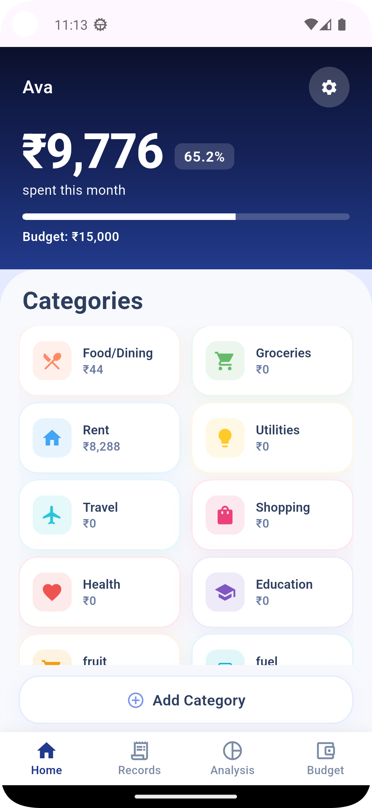
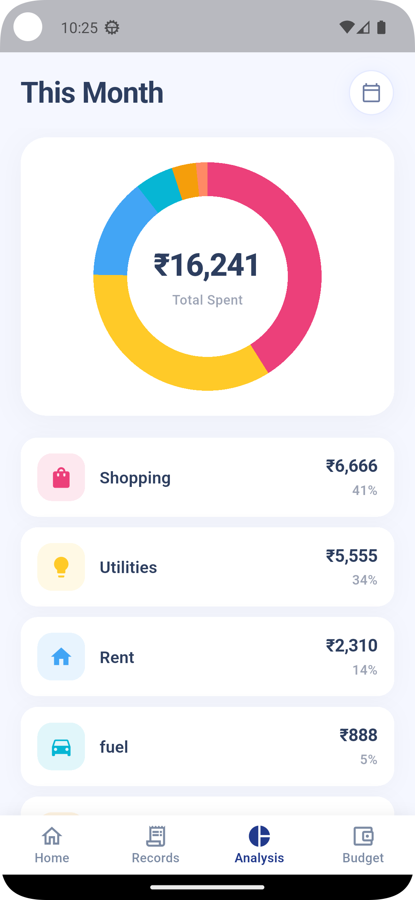
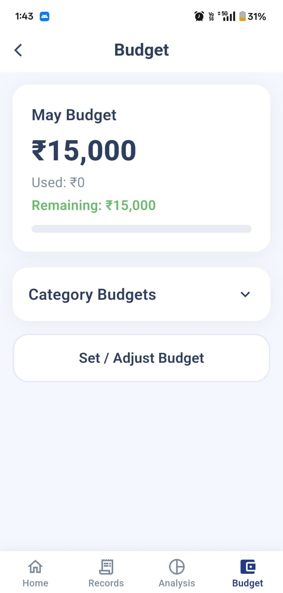
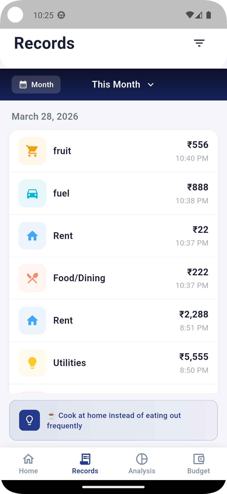
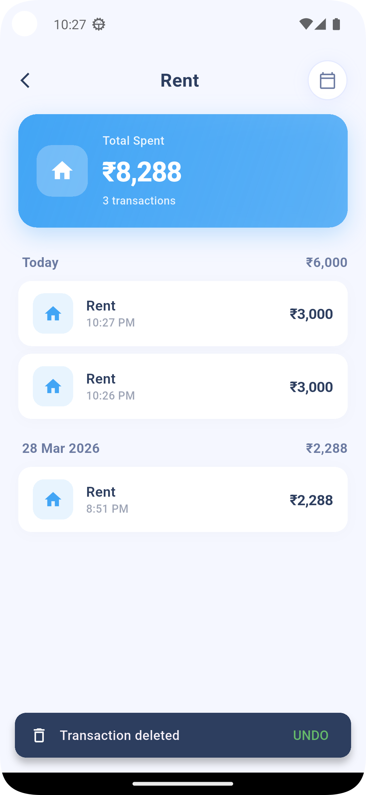

# VAULT

Modern Offline-First Expense Tracker built with Flutter

---

## ✨ About Vault

Vault is a modern expense tracking application focused on:

- simplicity
- speed
- privacy
- smooth user experience

Unlike bloated finance apps, Vault is designed for real everyday usability with a clean fintech-inspired interface.

---

## ⚡ Features

- ⚡ One-tap expense saving
- 🔒 Fully offline-first architecture
- 🛡 No unnecessary permissions
- 🚫 No login or account creation required
- 💎 Premium fintech-inspired UI
- 📊 Smart budgeting & spending insights
- 📱 Lightweight and smooth experience
- 🧠 Designed for fast daily usage
- 📝 Clean records & transaction history

---

## 📲 Download

---

## 🛠 Tech Stack

Flutter  
Dart  
SQLite  
Provider  
Material Design  

---

## 🚀 Vision

The goal of Vault is to create a modern personal finance experience that feels:
- fast
- clean
- practical
- enjoyable to use daily

---

## 👨‍💻 Developer

Harsh Pandey  
App Developer • SaaS & Product Builder • Finance Enthusiast

---

## ⭐ Support

If you like the project, consider starring the repository.

---

## 📸 Screenshots

### Home Screen

### Analysis Screen

### Budget Screen

### Records Screen

### 📊 Spending Analysis

